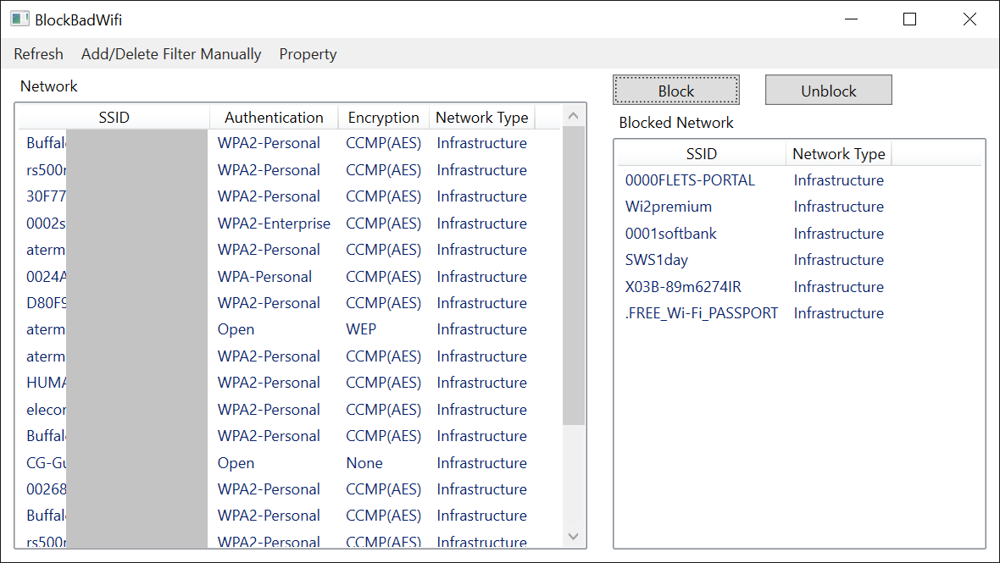

# BlockBadWifi
It can block any wifi access points.

It is effective in preventing your PC from connecting to open wifi hotspots even when you unchecked "connect automatically".

The access points you blocked are excluded from the list of available wifi networks.

任意のWifiアクセスポイントをブロックできます。

「自動的に接続」をオフにしていても接続されてしまうオープンWifi対策に有効です。

ブロックしたアクセスポイントは利用可能なWifiネットワークのリストから除外されます。

## Requirements / 動作環境
Windows7 and later / Windows7以上

.NET Framework 4.7.2
